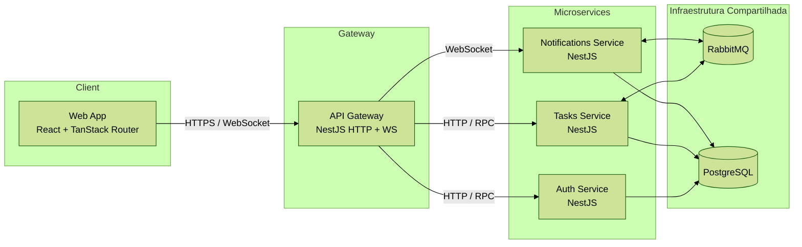

    # Desafio Full-stack Júnior — Sistema de Gestão de Tarefas Colaborativo

[](#como-rodar)
[](#arquitetura)
[](#arquitetura)
[](#testes-e-qualidade)

Plataforma colaborativa para squads organizarem tarefas com comentários em tempo real, notificações persistidas e autenticação JWT. O monorepo usa **Turborepo** para orquestrar quatro serviços **NestJS** e um front-end **React** (TanStack Router + shadcn/ui + TailwindCSS), integrados por **RabbitMQ** e **PostgreSQL**.

<!-- Atualize o link do GIF após gravar a demo -->

## Sumário
- [Visão Geral](#visão-geral)
- [Arquitetura](#arquitetura)
- [Modelo de Dados](#modelo-de-dados)
- [Mensageria (RabbitMQ)](#mensageria-rabbitmq)
- [Fluxos Principais](#fluxos-principais)
- [Decisões Técnicas e Trade-offs](#decisões-técnicas-e-trade-offs)
- [Como Rodar](#como-rodar)
- [Observabilidade e Segurança](#observabilidade-e-segurança)
- [Testes e Qualidade](#testes-e-qualidade)
- [Tempo Gasto e Aprendizados](#tempo-gasto-e-aprendizados)
- [Próximos Passos](#próximos-passos)
- [Extras Implementados](#extras-implementados)

## Visão Geral
- API pública exposta via gateway NestJS, com Swagger em [`http://localhost:3001/api/docs`](http://localhost:3001/api/docs).【F:apps/api/src/main.ts†L58-L87】
- Front-end Vite + React servindo em [`http://localhost:3000`](http://localhost:3000) com autenticação, lista de tarefas e comentários em tempo real.【F:apps/web/src/features/tasks/pages/TasksPage.tsx†L1-L120】【F:apps/web/src/features/notifications/components/NotificationsPopover.tsx†L1-L120】
- Notificações assíncronas são persistidas e retransmitidas via WebSocket para manter usuários alinhados.【F:apps/notifications/src/notifications.service.ts†L1-L118】

## Arquitetura
Diagrama em alto nível descrevendo os containers principais (arquivo fonte em [`docs/architecture.mmd`](docs/architecture.mmd)):



| Serviço | Porta padrão | Stack principal | Comunicação | Responsabilidade |
|---------|--------------|-----------------|-------------|------------------|
| `web` | 3000 | React + Vite + TanStack Router + shadcn/ui | HTTP (REST), WebSocket | UI autenticada com filtros, comentários, toasts e badges em tempo real |
| `api-gateway` | 3001 (HTTP & WS) | NestJS + Swagger + Guards JWT | HTTP, WebSocket, RPC | Autenticação JWT, orquestração REST/WS e proxy para microserviços | 
| `auth-service` | 4010 (TCP) | NestJS + TypeORM | RPC RMQ, PostgreSQL | Registro/login, emissão e rotação de tokens JWT | 
| `tasks-service` | `tasks.rpc` (fila RMQ) | NestJS + TypeORM | RPC RMQ, RabbitMQ, PostgreSQL | CRUD de tarefas/comentários, audit log e eventos `task.*` | 
| `notifications-service` | `notifications.rpc` (fila RMQ) | NestJS + TypeORM | RPC RMQ, RabbitMQ, PostgreSQL | Persistência e difusão de notificações com correlação | 
| `rabbitmq` | 5672 / 15672 | RabbitMQ | AMQP | Broker de mensageria assíncrona |
| `postgres` | 5432 | PostgreSQL 17 | SQL | Persistência relacional |

## Modelo de Dados
| Entidade | Campos principais | Origem |
|----------|-------------------|--------|
| `users` | `id`, `email`, `name`, `passwordHash`, `refreshTokenHash` | Auth Service (TypeORM)【F:apps/auth/src/users/entities/user.entity.ts†L1-L18】 |
| `tasks` | `id`, `title`, `description`, `status`, `priority`, `dueDate`, `assignees[]`, `createdAt`, `updatedAt` | Tasks Service (TypeORM)【F:apps/tasks/src/tasks/task.entity.ts†L1-L36】 |
| `task_comments` | `id`, `taskId`, `authorId`, `authorName`, `message`, `createdAt`, `updatedAt` | Tasks Service (TypeORM)【F:apps/tasks/src/comments/comment.entity.ts†L1-L37】 |
| `task_audit_logs` | `id`, `taskId`, `actor`, `changes`, `metadata`, `createdAt` | Tasks Service (TypeORM)【F:apps/tasks/src/tasks/task-audit-log.entity.ts†L1-L45】 |
| `notifications` | `id`, `recipientId`, `channel`, `status`, `message`, `metadata`, `createdAt`, `sentAt` | Notifications Service (TypeORM)【F:apps/notifications/src/notifications/notification.entity.ts†L1-L35】 |

## Mensageria (RabbitMQ)
Integração assíncrona garante desacoplamento entre criação/atualização de tarefas e notificações. Fila e tópicos principais são compartilhados em `@repo/types`.【F:packages/types/src/contracts/queues.ts†L1-L9】

| Recurso | Nome | Uso |
|---------|------|-----|
| Fila RPC (tasks) | `tasks.rpc` | Chamadas RPC do gateway para o serviço de tarefas | 
| Fila de eventos (tasks) | `tasks.events` | Publicação de eventos `task.*` para consumidores interessados | 
| Fila RPC (notifications) | `notifications.rpc` | Consultas de notificações via gateway | 
| Fila de eventos (notifications) | `notifications.events` | Fan-out de notificações persistidas | 
| Fila de broadcast do gateway | `gateway.events` | Eventos encaminhados para WebSocket | 

Eventos publicados pelo `tasks-service` e encaminhados para o gateway/notifications (arquivo fonte em [`packages/types/src/contracts/events/tasks.ts`](packages/types/src/contracts/events/tasks.ts)):

| Evento | Publisher | Consumers | Payload resumido |
|--------|-----------|-----------|------------------|
| `task.created` | `tasks-service` | `notifications-service`, gateway | `{ task, recipients[], actor }` |
| `task.updated` | `tasks-service` | `notifications-service`, gateway | `{ task, changes[], recipients[], actor }` |
| `task.deleted` | `tasks-service` | `notifications-service`, gateway | `{ task, recipients[], actor }` |
| `task.comment.created` | `tasks-service` | `notifications-service`, gateway | `{ comment, recipients[] }` |

## Fluxos Principais
Diagramas mantidos na pasta [`docs/flows`](docs/flows/) para edição colaborativa.

1. **Login + Refresh Token** — [`login-refresh.mmd`](docs/flows/login-refresh.mmd)
2. **Criação de tarefa + notificação** — [`create-task.mmd`](docs/flows/create-task.mmd)
3. **Comentário com atualização em tempo real** — [`comment-realtime.mmd`](docs/flows/comment-realtime.mmd)

## Decisões Técnicas e Trade-offs
| Tema | Decisão | Motivo |
|------|---------|--------|
| ORM | TypeORM em todos os serviços | Reutilizar migrations existentes e aproveitar recursos de `enum`/`jsonb` | 
| Mensageria | RabbitMQ + padrão pub/sub e RPC | Garante consistência eventual e desacoplamento entre domínios | 
| Estado Global | React Query + Zustand | Cache de requisições + estado local previsível em cenários realtime | 
| Tokens | Access JWT (15 min) + Refresh cookie HTTP-only | Minimiza risco de vazamento e permite reautenticação silenciosa【F:apps/api/src/auth/auth.controller.ts†L27-L130】 |
| Router | TanStack Router | Data loading, rotas aninhadas e divisão automática de bundles | 
| Build | Turborepo com pipelines incrementais | Builds rápidos e compartilhamento de cache entre apps | 

## Como Rodar
Requisitos: Docker >= 24, Docker Compose, Node 18+ (apenas se for rodar scripts locais) e PNPM.

```bash
cp .env.example .env
# Ajuste segredos JWT, URLs de banco e broker conforme necessidade

docker compose up --build
```

Ao subir a stack:
- 🐳 `postgres` aplica migrations e seeds automáticos.
- 🐳 `rabbitmq` disponibiliza painel em `http://localhost:15672` (`admin`/`admin`).
- 🐳 `auth-service`, `tasks-service` e `notifications-service` aguardam disponibilidade do banco antes do bootstrap.【F:apps/tasks/src/main.ts†L1-L83】【F:apps/notifications/src/main.ts†L1-L84】
- 🐳 `api-gateway` expõe REST/WS com Swagger em `/api/docs` e health-check em `/api/health`.
- 🐳 `web` conecta-se ao gateway, carrega seeds e inicia socket para notificações.

Scripts adicionais:
- `pnpm dev` — inicia serviços em hot-reload (docker opcional).
- `pnpm test` — executa suíte de testes de todos os serviços (Jest/Vitest).
- `pnpm lint` / `pnpm check-types` — garantem qualidade estática e consistência de tipos.

## Observabilidade e Segurança
- Logs estruturados com propagação de `request-id` entre HTTP, RPC e filas via `@repo/logger`.【F:packages/logger/src/app-logger.service.ts†L31-L117】
- Rate limiting e proteção com Helmet + CORS configurável no gateway.【F:apps/api/src/common/guards/rate-limit.guard.ts†L13-L86】【F:apps/api/src/main.ts†L37-L76】
- Health/readiness endpoints expostos em todos os serviços (`/api/health`, handlers `health.check`).【F:apps/api/src/health/health.controller.ts†L11-L55】【F:apps/tasks/src/health/health.controller.ts†L11-L58】
- Persistência de notificações garante reentregas com `nack` em falhas transitórias.【F:apps/notifications/src/notifications.service.ts†L62-L118】

## Testes e Qualidade
- **Auth Service** — testes unitários e de integração com Nest Testing Module e banco em memória.【F:apps/auth/src/auth/auth.service.spec.ts†L1-L101】
- **Tasks Service** — suíte com `pg-mem` cobrindo casos de CRUD, comentários e audit log.【F:apps/tasks/src/tasks/tasks.service.spec.ts†L1-L123】
- **Notifications Service** — integração assíncrona validando consumo/publicação de eventos.【F:apps/notifications/src/notifications/notifications.service.integration.spec.ts†L1-L118】
- **Front-end** — componentes validados com Vitest + React Testing Library.【F:apps/web/src/features/tasks/pages/__tests__/TasksPage.test.tsx†L1-L120】
- Linters e checagem de tipos rodando via Turborepo (`pnpm lint`, `pnpm check-types`).

## Tempo Gasto e Aprendizados
| Módulo | Destaques & aprendizados |
|--------|-------------------------|
| Autenticação | Guardas reutilizáveis, interceptores de correlação e espera ativa por PostgreSQL no bootstrap.【F:apps/auth/src/main.ts†L1-L64】 |
| Tarefas | Normalização de diffs para audit log e filtros avançados com TypeORM/JSONB.【F:apps/tasks/src/tasks/tasks.service.ts†L61-L247】 |
| Notificações | Retry controlado via `nack`, persistência paginada e broadcast WebSocket.【F:apps/notifications/src/notifications.service.ts†L62-L118】 |
| Front-end | Hooks compartilhados para realtime, integração com sockets e feedback via toasts.【F:apps/web/src/features/tasks/pages/TasksPage.tsx†L1-L120】【F:apps/web/src/features/notifications/components/NotificationsPopover.tsx†L1-L144】 |

## Próximos Passos
1. Painel administrativo com RBAC avançado e gestão de usuários.
2. Cache de leitura em Redis para listas de tarefas e notificações.
3. Pipelines CI/CD (lint/test/build) com GitHub Actions.
4. Testes end-to-end com Playwright cobrindo fluxos críticos.

## Extras Implementados
- [x] Autenticação completa (login, refresh, logout) com cookies HTTP-only.【F:apps/api/src/auth/auth.controller.ts†L27-L130】
- [x] Comentários em tarefas com paginação e audit log detalhado.【F:apps/tasks/src/tasks/task-audit-logs.service.ts†L17-L83】
- [x] Notificações persistidas com filtros por status, canal e período.【F:apps/api/src/notifications/notifications.controller.ts†L24-L65】
- [x] WebSocket resiliente com reconexão e badges em tempo real.【F:apps/web/src/lib/ws-client.ts†L1-L24】【F:apps/web/src/features/notifications/components/NotificationsPopover.tsx†L80-L160】
- [x] Diagramas Mermaid atualizados (`docs/architecture.mmd`, `docs/flows/*`).

---

🧠 **Documentação útil**
- Swagger: [`http://localhost:3001/api/docs`](http://localhost:3001/api/docs)
- Health-check: [`http://localhost:3001/api/health`](http://localhost:3001/api/health)
- RabbitMQ Management: [`http://localhost:15672`](http://localhost:15672)

🧩 **Contato & créditos**
Projeto desenvolvido para o desafio técnico da Jungle Gaming.
