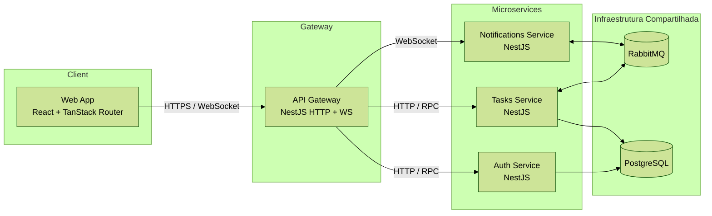
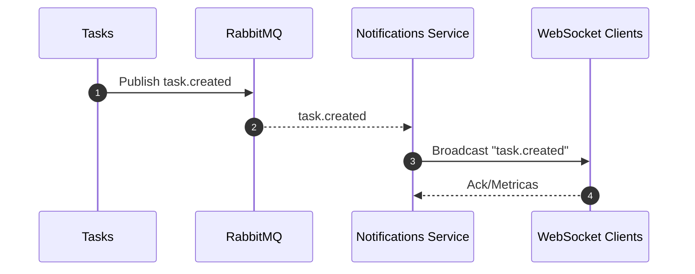
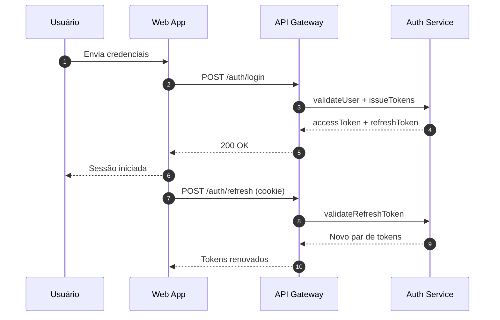
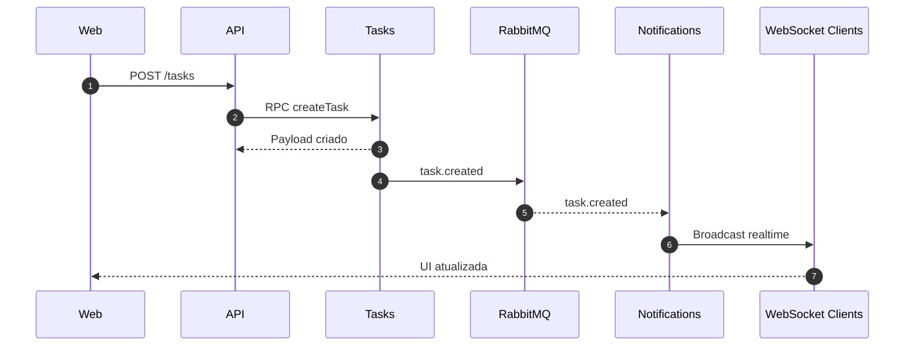
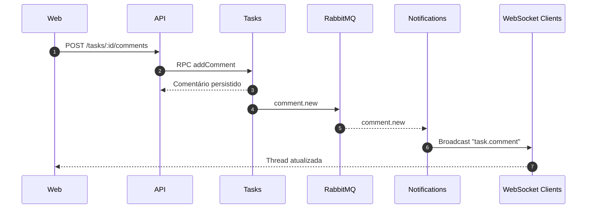

# Desafio Full-stack Júnior — Sistema de Gestão de Tarefas Colaborativo

[](#como-rodar)
[](#arquitetura)
[](#arquitetura)
[](#extras-implementados)

Sistema colaborativo para planejamento e acompanhamento de tarefas, com autenticação segura, mensageria assíncrona e atualização em tempo real.

<!-- Atualize o link do GIF após gravar a demo -->

## Sumário
- [Visão Geral](#visão-geral)
- [Arquitetura](#arquitetura)
- [Mensageria (RabbitMQ)](#mensageria-rabbitmq)
- [Fluxos Principais](#fluxos-principais)
- [Decisões Técnicas e Trade-offs](#decisões-técnicas-e-trade-offs)
- [Como Rodar](#como-rodar)
- [Observabilidade e Segurança](#observabilidade-e-segurança)
- [Tempo Gasto e Aprendizados](#tempo-gasto-e-aprendizados)
- [Próximos Passos](#próximos-passos)
- [Extras Implementados](#extras-implementados)

## Visão Geral
Plataforma que permite squads organizarem tarefas com comentários em tempo real, notificações instantâneas e controle de acesso granular. O monorepo usa **Turborepo** para orquestrar quatro microserviços **NestJS** e um front-end **React** (TanStack Router + shadcn/ui + TailwindCSS), integrados por **RabbitMQ** e **PostgreSQL**.

- API pública exposta via API Gateway em NestJS com Swagger disponível em [`http://localhost:3000/api/docs`](http://localhost:3000/api/docs).
- Front-end web servindo em [`http://localhost:5173`](http://localhost:5173) com theming dark/light e WebSockets.
- <!-- Atualize o link da apresentação externa, se existir -->[Demo hospedada (opcional)](https://example.com).

## Arquitetura
Diagrama em alto nível descrevendo os containers principais (arquivo fonte em [`docs/architecture.mmd`](docs/architecture.mmd)):



| Serviço | Porta padrão | Stack principal | Comunicação | Responsabilidade |
|---------|--------------|-----------------|-------------|------------------|
| `web` | 5173 | React + Vite + TanStack Router + shadcn/ui | HTTP (REST), WebSocket | UI responsiva, tema dark/light, consumo de API e recebimento de eventos em tempo real |
| `api-gateway` | 3000 (HTTP) / 3001 (WS) | NestJS + Swagger + Guards JWT | HTTP, WebSocket, RPC | Autenticação de requests, orquestração REST/WS, proxy para microserviços |
| `auth-service` | 3002 | NestJS + Prisma | RPC, PostgreSQL | Registro/login, emissão de access/refresh tokens, rotação segura |
| `tasks-service` | 3003 | NestJS + Prisma | RPC, RabbitMQ, PostgreSQL | CRUD de tarefas/comentários, emissão de eventos `task.*` |
| `notifications-service` | 3004 | NestJS + WebSockets | RabbitMQ, WebSocket | Consumo de eventos, broadcasting para clientes, fan-out com request-id |
| `rabbitmq` | 5672 / 15672 | RabbitMQ | AMQP | Broker de mensageria assíncrona |
| `postgres` | 5432 | PostgreSQL 15 | SQL | Persistência relacional, integra Prisma |

## Mensageria (RabbitMQ)
Integração assíncrona garante desacoplamento entre criação/atualização de tarefas e notificações. Eventos principais:

| Evento | Publisher | Consumers | Payload resumido |
|--------|-----------|-----------|------------------|
| `task.created` | `tasks-service` | `notifications-service` | `{ id, title, assignees[], createdBy, status }` |
| `task.updated` | `tasks-service` | `notifications-service` | `{ id, diff, updatedBy, updatedAt }` |
| `comment.new` | `tasks-service` | `notifications-service` | `{ taskId, commentId, author, message, mentionedUsers[] }` |

Fluxo pub/sub detalhado entre Tasks e Notifications (arquivo fonte em [`docs/flows/create-task.mmd`](docs/flows/create-task.mmd)):



## Fluxos Principais
Diagramas mantidos na pasta [`docs/flows`](docs/flows/) para edição.

### 1. Login + Refresh Token


### 2. Criar tarefa e notificar usuários


### 3. Comentar tarefa com atualização em tempo real


## Decisões Técnicas e Trade-offs
| Tema | Decisão | Motivo |
|------|---------|--------|
| ORM | Prisma com migrations versionadas | Produtividade, tipagem gerada e integração nativa com PostgreSQL |
| Mensageria | RabbitMQ + padrão pub/sub | Garante consistência eventual sem acoplar Tasks e Notifications |
| Estado Global | React Query + Zustand | Cache de requisições + estado local previsível em tempo real |
| Tokens | Access JWT curto + Refresh JWT em cookie HTTP-only | Minimiza risco de vazamento e permite reautenticação silenciosa |
| Router | TanStack Router no front | Suporte a data loading, loaders paralelos e rotas aninhadas |
| Build | Turborepo com pipelines incrementais | Garante builds rápidos e compartilhamento de cache |

## Como Rodar
Requisitos: Docker >= 24, Docker Compose, Node 18+ (apenas se for rodar scripts locais) e PNPM.

```bash
cp .env.example .env
# Ajuste segredos JWT e URLs conforme necessidade

docker compose up --build
```

Ao subir a stack:
- 🐳 `postgres` aplica migrations e seeds automáticos.
- 🐳 `rabbitmq` disponibiliza painel em `http://localhost:15672` (guest/guest).
- 🐳 `auth-service`, `tasks-service` e `notifications-service` sincronizam schemas Prisma e se registram no broker.
- 🐳 `api-gateway` expõe REST/WS com Swagger em `/api/docs`, health-check em `/health` e readiness em `/ready`.
- 🐳 `web` conecta-se ao gateway, popula dados de seed e inicia socket para notificações.

Scripts adicionais:
- `pnpm dev` — inicia serviços em hot-reload (docker opcional).
- `pnpm test` — executa suíte de testes (auth + tasks).
- `make dev` / `make test` — <!-- Atualize caso exista Makefile -->atalhos opcionais se Makefile estiver disponível.

## Observabilidade e Segurança
- Logs estruturados via Pino, enriquecidos com `request-id` propagado entre HTTP e filas.
- Rate limiting e proteção por `@nestjs/throttler` no gateway.
- Middleware Helmet + política CORS restrita aos domínios configurados em `.env`.
- Interceptores de auditoria registram diffs de tarefas com mascaramento automático de campos sensíveis.
- Endpoints de saúde: `GET /health` (liveness) e `GET /ready` (readiness) em todos os serviços NestJS.
- Alertas configuráveis via exchanges RabbitMQ para falhas de consumo (DLQ).

## Tempo Gasto e Aprendizados
| Módulo | Tempo (h) | Desafios | Soluções/Aprendizados |
|--------|-----------|----------|-----------------------|
| Autenticação | <!-- Atualize com o tempo real -->6 | Refresh token seguro, rotação simultânea | Implementação de cookies HTTP-only + blacklist em memória distribuída |
| Tasks | <!-- Atualize com o tempo real -->8 | Consistência de estados e diffs | Uso de Prisma `@updatedAt`, eventos e auditoria normalizada |
| WebSockets | <!-- Atualize com o tempo real -->4 | Sincronização multi-aba | Canal WS com rooms por tarefa e fallback SSE |

## Próximos Passos
1. Painel administrativo com RBAC avançado.
2. Cache de leitura em Redis para listas de tarefas e comentários.
3. Deploy contínuo em Kubernetes (Helm charts + GitHub Actions).
4. Testes end-to-end com Playwright e ambientes provisionados via Terraform.

## Extras Implementados
- [x] Testes automatizados (auth + tasks)
- [x] Logs estruturados com request-id
- [x] Seeds automáticos via Docker
- [x] Diagramas Mermaid (`docs/architecture.mmd`, `docs/flows/*`)
- [x] Dockerfiles multi-stage
- [x] Tema dark/light e realtime WS
- [x] Rate limiting + Helmet + CORS endurecido

---

🧠 **Documentação útil**
- Swagger: [`http://localhost:3000/api/docs`](http://localhost:3000/api/docs)
- Health-check: [`http://localhost:3000/health`](http://localhost:3000/health)
- Readiness: [`http://localhost:3000/ready`](http://localhost:3000/ready)
- RabbitMQ Management: [`http://localhost:15672`](http://localhost:15672)

🧩 **Contato & créditos**
Projeto desenvolvido para o desafio técnico da Jungle Gaming.

<!-- Atualize com seu LinkedIn ou portfólio -->
**Autor:** [Seu Nome](https://www.linkedin.com/).
